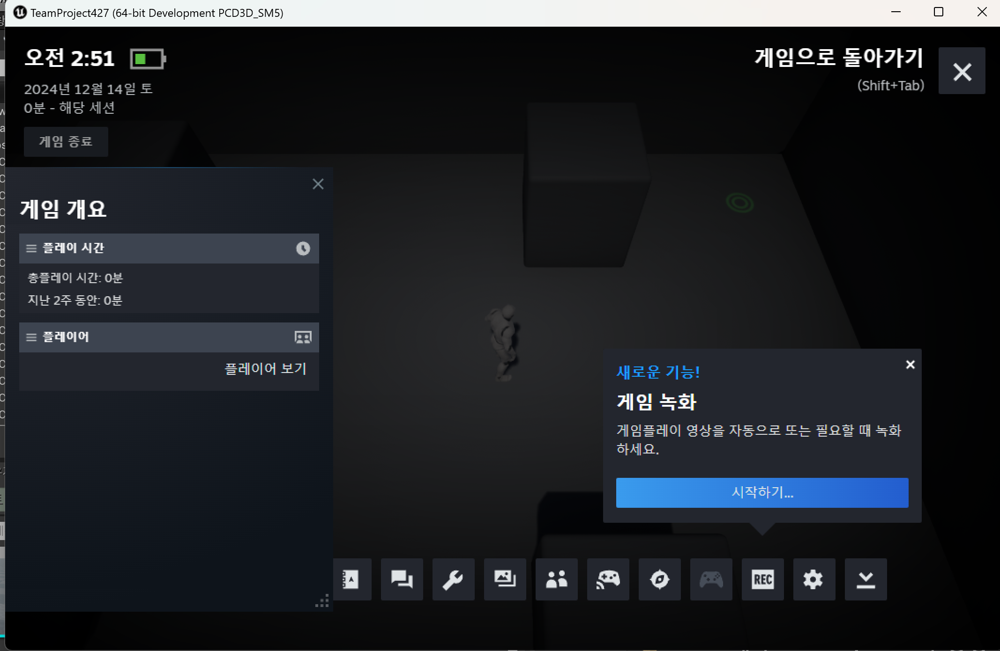

이번에 온라인 서브시스템  
온라인 서브시스템스팀 이렇게 하려는데  
왜 안되지 하다가 보니  
그냥.. 스팀 클라이언트가 실행이 안 되어있어서..  
하 그동안 개고생 한 건 뭐냐 진짜..  
스팀 설치 후 로그인해서 실행하니 된다. 화난다.  
  
참고로 내가 사용한 버전은 언리얼 4.27.2  
비주얼스튜디오2022 + C++로 게임제작 옵션  
옵션 제대로 잘 보고 체크해서 누락 없어야 함.  
그래야 언리얼파일에 제너릭 기능도 연결 잘 되는 듯?  
  
### (프로젝트 이름).Build.cs 에 내용추가 
폴더에서 .Build.cs 검색해서  
```
PublicDependencyModuleNames.AddRange(new string[] { "Core", "CoreUObject", "Engine", "InputCore", "EnhancedInput", "OnlineSubsystemSteam", "OnlineSubsystem" }); 
```
"OnlineSubsystemSteam", "OnlineSubsystem" 추가  
  
### DefaultEngine.ini 에 내용추가 
```
[/Script/Engine.GameEngine]
+NetDriverDefinitions=(DefName="GameNetDriver",DriverClassName="OnlineSubsystemSteam.SteamNetDriver",DriverClassNameFallback="OnlineSubsystemUtils.IpNetDriver")

[OnlineSubsystem]
DefaultPlatformService=Steam

[OnlineSubsystemSteam]
bEnabled=true
SteamDevAppId=480
bInitServerOnClient=true

[/Script/OnlineSubsystemSteam.SteamNetDriver]
NetConnectionClassName="OnlineSubsystemSteam.SteamNetConnection"
```

### (프로젝트이름).uproject 파일 우클릭 
폴더에서 uproject 실행파일 우클릭  
-> Generate visual studio project files  
이거 누르면 돼요.  
  
만약 실행파일 아이콘이 파란색 언리얼모양으로  
안 되어있으면 연결프로그램 바꿔주세요.  
  
[아이콘 사진은 벨로그 @lee_raccoon님 참고](https://velog.io/@lee_raccoon/%EC%96%B8%EB%A6%AC%EC%96%BC-%EC%97%94%EC%A7%84-%EC%98%A8%EB%9D%BC%EC%9D%B8-%EC%84%9C%EB%B8%8C%EC%8B%9C%EC%8A%A4%ED%85%9C%EC%8A%A4%ED%8C%80-%EC%95%8C%EC%95%84%EB%B3%B4%EA%B8%B0)  
  
### 성공한 코드 
```
// Fill out your copyright notice in the Description page of Project Settings.

#include "SteamSub.h"
#include "OnlineSubsystem.h"
#include "Interfaces/OnlineSessionInterface.h"


// Sets default values
ASteamSub::ASteamSub()
{
 	// Set this actor to call Tick() every frame.  You can turn this off to improve performance if you don't need it.
	PrimaryActorTick.bCanEverTick = false;

}

// 게임시작시호출 
void ASteamSub::BeginPlay()
{
	Super::BeginPlay();
	
    // 스팀 서브시스템 확인
    IOnlineSubsystem* OnlineSubsystem = IOnlineSubsystem::Get();
    if (OnlineSubsystem)
    {
        FString SubsystemName = OnlineSubsystem->GetSubsystemName().ToString();

        if (OnlineSubsystem)
        {
            OnlineSubsystem->GetSessionInterface();
        }
        else
        {
            UE_LOG(LogTemp, Error, TEXT("No Online Subsystem found!"));
        }
    }
}

// Called every frame
void ASteamSub::Tick(float DeltaTime)
{
	Super::Tick(DeltaTime);
}
```

실행하면 잘 돌아가긴 한다. (플레이X)  
  
  
  
