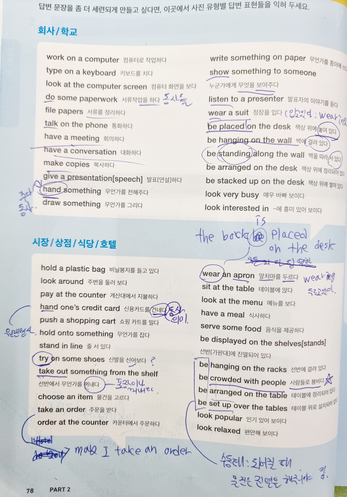

토익 스피킹 기출 스타트 - ETS TOEIC  

2024-11-??  
  
### 전에 정리 못 한 것들 
연예인 입장하는데 혼자 형 거리면서 편하게 대화하길래  
님 이 사람 어떻게 알아요? 물어보는 상황에선  
왜 Why 보단 how가 낫다  
  
```
How did you know (  )?  
그 (  )을 어떻게 알아?  
```
  
** 해깔릴 수 있는 단어 **  
tell - 말하다 (대화가 오고 감)  
cay - 말하다 (좀 더 의무적으로 하는 대화)  
  
yet - 아직(부사)  
  
### p. 25 hvae 가지다 / have + p.p 해본 적 있다.  
  
I went to America once. - X  
I have been to America once. - O  
저는 미국에 한 번 가봤습니다.  
  
```
   hvae v+ p.p(과거분사)  
과거 <------> 현재이다  
```
  
#### 과거분사(p.p) 설명 
1) 규칙적인 동사: ~ed  
play | played  
work | worked  
clean | cleaned  
  
2) 불규칙동사 (ed 외 형태)  
go | gone  
eat | eaten  
write | written  
  
#### 그 외 p.p(과거분사) 활용방식 
1) 현재완료 (Have / Has + p.p)  
"I have eaten" lunch  
나는 점심을 먹은 적이 있다.  
2) 과거완료 (Had + p.p)  
"I had finished" my homework before dinner  
저녁 먹기 전에 숙제를 끝냈다.  
3) 미래완료 (Will have + p.p)  
"I will have completed" the project by tomorrow  
내일까지 그 프로젝트를 끝낼 것이다  
  
#### 그냥 과거(사실)와 현재완료의 차이 
```
현재완료: I have eaten lunch  
점심을 먹은 경험이 있음. & 나는 이미 점심 먹었음  
  
시간: 과거랑 지금이 연결됨. 경험 강조임  
애매한 시간대 표현 정도 씀  
over, never, just, already, yet, before, etc 같은 게 붙음  
```
```
과거사실: I ate lunch  
나는 점심 먹었다.  
  
시간: 그냥 써도 먹었어. 할 순 있다만   
아 나 밥 먹었어. 하면 언제 먹었는지 물어볼 수 있음  
I ate lunch at 12 PM. 나는 12시에 점심 먹었다  
```
  
현재완료는 경험, 결과, 완료, 지속을 강조하는 표현이다.  
  
***
  
2024-11-11  
  
### p. 22 
조동사는 동사를 돕는 단어 (다시정리)  
```
will ~할 것이다  
can ~할 수 있다  
have to ~해야 한다  
should ~해야 한다, ~하는 것이 좋다  
조동사 뒤에는 동사원형 온다  
```
  
그 조동사의 의무감 크기  
```
(의무적)must > should > have to(덜 의무적)  
```
  
be동사: am, are, is, was, were  
이런 게 주어에 따라 올 수 있음  
  
조동사 무게에 따른 문장 예시  
```
동사원형: can deangerous X / can be deangerous O 느낌  
  
1. He "will(조동사)" "come(동사원형)" to my office tomorrow  
그가 내일 제 사무실로 올 것입니다.  
  
2. You "have to(조동사)" "register(등록하다:동사)" for the seminar as soon as possible  
가능한 빨리 세미나에 등록해야 합니다.  
  
3. You should(조) take(동) an online class at night  
밤에 동영상 강의를 들어야 합니다.  
  
4. He must(조) be a native English speaker  
그는 영어 원어민임에 틀림없습니다.   
```
  
### p. 24 하는 것(능동태:직간) 되는 것(수동태:간to직) 
전에 했던 게 사람은 직접목적어, 사물은 간접목적어  
```
간접이 먼저 오면: 간접목적어 to 직접목적어  
직접이 먼저 오면: 직접목적어 간접목적어  
```
  
누군가의 의해(수동태)는 be + p.p(과거분사)이다  
능동 예시론 I + ables 내가 덮다 같은 식  
  
```
능동: The manager hired the new employee  
뜻 기억 안남.. 매니저가 새 직원을 채용했습니다. 일 듯  
수동: The new employee was hired by the manager  
새 직원이 매니저에 의해 채용되었습니다.  
```
  
  
### p. 76 사진설명 저번숙제 
*The man in a blue shirt is standing at the table.  
파란 셔츠를 입은 남자가 테이블 앞에 서 있습니다.  
I think he is a waiter and taking an order.  
그는 웨이터이고, 주문을 받는 중이라 생각합니다.  
Three women are sitting(앉다 + ing현재) around the table.  
세 명의 여자들은 테이블 둘레에 앉아 있습니다.  
  
### p. 77 사진설명 저번숙제 
*This picture was taken on the street  
이 사진은 길거리에서 찍혔습니다.  
*There is a tall tree standing on the left  
왼쪽에 큰 나무가 서 있습니다.  
  
*** 
  
2024-11-12  
  
### p. 25 have + p.p 사용 
have + p.p(과거분사)는  
~적 있다. 같은 경험 이야기거나  
막 떠났을 때 등의 상태 강조할 때 씀  
  
have => 가지다의 뜻은 없다  
have 자체에 가지다란 뜻은 없지만  
"I have 셀폰"이라고 하면 내 폰 가지고 있는 거지만..  
  
#### Have + p.p ==> 과거에 했다 예시  
```
have + p.p  
방금 막 ~했다  
~한 적이 있다  
~해오고 있다  
```
  
### p. 90 알면 좋은 영어표현 
1) I rather gift ()  
() 이 선물이 낫겠다  
  
rather: 이게 낫다  
  
2) It's expensive  
그건 비싸요  
  
Why is this so expensive  
왜 이게 이렇게 비싸요?  
  
This bag is expensive  
이 가방은 비싸다  
  
That car is too expensive for me  
저 차는 나한테 너무 비싸다  
  
from inexpensive to expensive  
저렴한 것부터 비싼 것까지  
  
3) What are the advantages of living in your area?  
당신이 사는 지역의 장점은 무엇입니까?  
  
advantages = 장점  
dis advantages = 단점  
  
### p. 92 일상생활 용어 추가 
```
find a parking space 주차 공간을 찾다  
recycle used items 사용한 제품을 재활용하다  
make donations 기부하다 (= donate money)  
stay healthy 건강을 유지하다  
get rid of stress 스트레스를 풀다  
how did your relieve strees 스트레스 어캐 풀어?
how did your get strees 스트레스 어캐 받았어?  
get fresh air 신선한 공기를 마시다  

water(물 주다-동) plants 식물에 물을 주다  
buy items online 상품을 온라인에서 사다  
odpread people's reviews 사람들의 후기를 읽다  
keep A clean A를 깨끗하게 유지하다  
use public transportation 대중교통을 이용하다  
get advice from my friends 친구들에게 조언을 얻다  
```
  
### 사진 영어표현 
  
  

### 나중에 써먹고 싶은 질문 
Do you know chatGPT  
너 GPT 알아?  
How did you know chatGPT  
너 GPT 어떻게 알아?  
