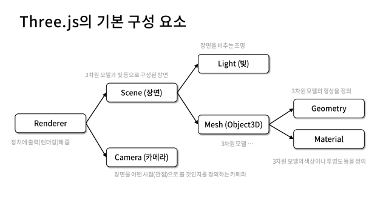
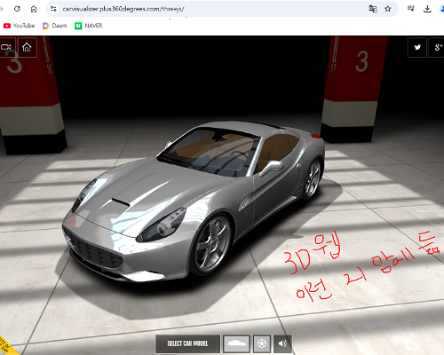
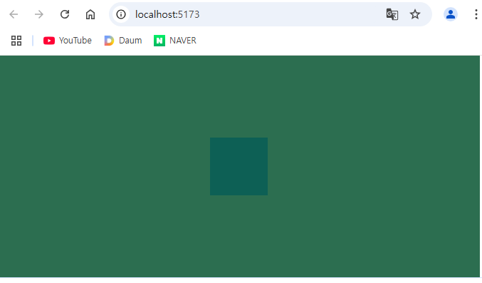
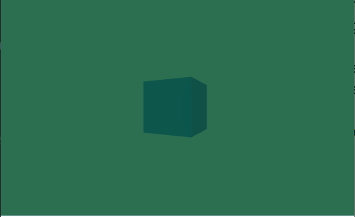
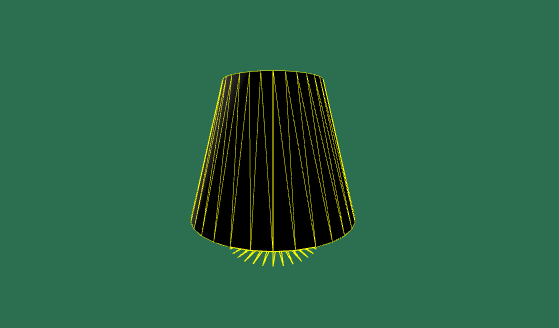

### 웹3D그래픽개발수업 1일차 (threejs) 
2024-11-29  

  
  
Three 구성요소  
렌더러 -> 씬, 카메라, 빛, Mesh, Geometry, Material    
  
[교육자료링크](https://bit.ly/4fNMg62)  
[개발자문서로 공부하면 좋다](https://threejs.org/docs/index#api/en/geometries/DodecahedronGeometry)  
  
이번 수업은 Three.js사용  
자바스크립트만 사용하면  
규모 있는 프로젝트가 어려움  
  
#### 웹 포폴 모음 사이트 
[Three.js 3D관련 웹 포폴모음](https://threejs.org/)  
  
Three.js가 3D웹 만들기 좋은 것이니  
웹게임 만들기 좋을 것 같음  
  
  
  
#### Cursor(IDE) 설치  
Visual Studio Code 대신 이번은 Cursor 사용 (새로 나온지 1년도 안됨)  
[Cursor(AI) 다운로드(2주무료)](https://www.cursor.com/)  
자동완성 많고 Ctrl + L 하면 그 코드에서 바로 AI 질문 수정 가능  
이건 Ctrl + K, Ctrl + L 모두 AI가능  
  
설치 중 -> Help Imporve Cursor선택하면  
내가 만든 코드 그 회사에서 볼 수 있음  
Private하면 안 가는데 나중에 돈 내야 함.  
  
#### node 설치 
[node설치링크](https://nodejs.org/en)  
cmd 명령: npm  
결과:  
```
npm <command>

Usage:

npm install        install all the dependencies in your project... 
```
  
#### blender 설치
[blender 설치링크](https://www.blender.org/download/)  
사용한 블렌더 버전: 4.3.0  
  
#### Three.js를 위한 cmd명령 
cmd가 잘 먹히면  
IDE의 커맨드 프롬포트로  
  
1) **npm create vite@latest .**  
(latest최신버전 / .현재 파일)  
대답: y  
선택1: 바닐라  
선택2: 자바스크립트  
  
2) **npm install**  
  
3) **npm install three**  
  
4) **npm run dev**  
  
#### package.json 중 중요한 구간 
```
"dependencies": {
    "three": "^0.170.0"
  }
```
최종 사용할 때  
dependencies 배포하거든요  
문제가 생기면 package-lock.json지우면 됨  
  
#### 파일 내용 정리 
public -> vite.svg 지워도 됨  
  
src -> counter.js, javascript.svg 지워도 됨  
main.js는 import './style.css'빼고 다 지우기  
  
style.css 내용 싹 삭제  
  
index.html -> 
```
<link rel="icon" type="image/svg+xml" href="/vite.svg" />삭제  
```
  
#### 웹 콘솔체크 
웹 Fn + F12로 콘솔 보기  
... 눌러서 아래로 위치  
  
세팅은 끝  
  
*** 
  
### 코드 입력해보기 
#### main.js -> Hello three.js 출력  
```
import './style.css'

class App {
  constructor() {
    console.log('App'); 
  }
}

new App() 
```
결과: Hello three.js  
  
#### main.js -> 메서드로 Hello three.js 가져오기 
```
import './style.css'

class App {
  constructor() {
    this.sayHello();
  }

  sayHello() {
    console.log('Hello three.js'); 
  }
}

new App(); 
```
결과: Hello three.js  
  
#### 주의사항 코드 예시 
```
import './style.css'

class App {
  #age = 20; //#은 private이다. 
  constructor() {
    this.sayHello();
    this._talk(); 

    //this.age = 20; 
  }

  sayHello() {
    console.log('Hello three.js'); 
  }

  _talk() {
    console.log('talk'); 
    this.age++; 
  }
}

const app = new App();
app.sayHello(); // public 
//app._talk(); // _이 앞에 붙으면 외부에서 사용하지 않는다. 규칙어긋남! 
//console.log(app.#age); // #이 앞에 붙으면 private이다. 오류! 
```
  
#### App 출력해보기 
```
import './style.css'

class App {

  constructor() {
    console.log('Hello three.js'); 

    this._setupThreeJs(); 

  }

  _setupThreeJs() {
    const divContainer = document.querySelector('#app'); //이름 틀리면 null 나옴 
    console.log(divContainer); 
  }

}

const app = new App();
```
  
#### 렌더러 만들기 시작 
```
import * as THREE from 'three';
import './style.css'

class App {

  constructor() {
    console.log('Hello three.js'); 
    this._setupThreeJs(); 
  }

  _setupThreeJs() {
    const divContainer = document.querySelector('#app'); //이름 틀리면 null 나옴 
    console.log(divContainer); 

    // 렌더러를 만드는 과정 
    let renderer = new THREE.WebGLRenderer({ antialias: true });  //antialias = 픽셀을 부드럽게: ture 
    renderer.setClearColor(new THREE.Color("#2cse50")); 
    renderer.setPixelRatio(window.devicePixelRatio); //픽셀이 섬세해짐 
    renderer.appendChild(renderer.domElement);

    this._renderer = renderer; //필드화 
  }
}

const app = new App();
```
  
  
  
#### 코드 구현 모습 
```
import * as THREE from 'three';
import './style.css'

class App {

  constructor() {
    console.log('Hello three.js'); 
    this._setupThreeJs(); 
    this._setupModel(); 
    this._setupLight(); 
    this._setupCamera(); 
    this._setupEvent(); 
  }

  _setupThreeJs() {
    const divContainer = document.querySelector('#app');
    
    let renderer = new THREE.WebGLRenderer({ antialias: true });
    renderer.setClearColor(new THREE.Color("#ffffff"));  // canvas 배경색을 흰색으로
    renderer.setPixelRatio(window.devicePixelRatio);
    divContainer.appendChild(renderer.domElement);
    this._divContainer = divContainer; 

    this._renderer = renderer;

    // Scene - 장면
    const scene = new THREE.Scene();
    scene.background = new THREE.Color("#2c6e50");  // scene의 배경색을 청록색으로
    this._scene = scene;
  }

  _setupCamera() { //카메라 
    const width = window.innerWidth; 
    const height = window.innerHeight; 
    const camera = new THREE.PerspectiveCamera(75, width / height, 0.1, 100); 
    camera.position.z = 3; 
    this._camera = camera; 
  }

  _setupLight() { //빛 - 조명
    const directionalLight = new THREE.DirectionalLight(0xffffff, 1); 
    directionalLight.position.set(1, 1, 4); 
    this._scene.add(directionalLight); 
  }

  _setupModel() {
    const geometry = new THREE.BoxGeometry(1, 1, 1); // Box geometry 가로,세로,깊이 
    const material = new THREE.MeshStandardMaterial({color: "#09A693"});//material = MeshStandardMaterial가 기본 
    const cube = new THREE.Mesh(geometry, material); // geometry와 material을 이용해 mesh 생성
    this._scene.add(cube); // scene에 mesh 추가
    this._mesh = cube; // 나중에 애니메이션 등에서 사용할 수 있도록 필드화로 저장 
  }

  render(){
    this._renderer.render(this._scene, this._camera); //렌더링 
  }

  _setupEvent(){
    window.addEventListener("resize", this.resize.bind(this)); 
    this.resize(); 
  }

  resize(){
    const width = this._divContainer.clientWidth;
    const height = this._divContainer.clientHeight;

    this._camera.aspect = width / height; 
    this._camera.updateProjectionMatrix(); 
    
    this._renderer.setSize(width, height);
    this.render(); 
  }
}

const app = new App();
```
결과:  
  
  
#### 이 코드에서의 bind 
[bind 설명 - 블로그 글](https://fansor.tistory.com/14)  
  
이제 tree.js의 큰 틀은 다 해본 것.  
사진 구성요소 다 함.  
  
*** 

### 직접 마우스로 3D를 돌릴 수 있도록 만들기
```
import * as THREE from 'three';
import './style.css'
import { OrbitControls } from 'three/addons/Addons.js';

class App {

  constructor() {
    console.log('Hello three.js'); 
    this._setupThreeJs(); 
    this._setupModel(); 
    this._setupLight(); 
    this._setupCamera(); 
    this._setupEvent(); 
    this._setControls(); 
  }

  _setupThreeJs() {
    const divContainer = document.querySelector('#app');
    
    let renderer = new THREE.WebGLRenderer({ antialias: true });
    renderer.setClearColor(new THREE.Color("#ffffff"));  // canvas 배경색을 흰색으로
    renderer.setPixelRatio(window.devicePixelRatio);
    divContainer.appendChild(renderer.domElement);
    this._divContainer = divContainer; 

    this._renderer = renderer;

    // Scene - 장면
    const scene = new THREE.Scene();
    scene.background = new THREE.Color("#2c6e50");  // scene의 배경색을 청록색으로
    this._scene = scene;
  }

  _setupCamera() { //카메라 
    const width = window.innerWidth; 
    const height = window.innerHeight; 
    const camera = new THREE.PerspectiveCamera(75, width / height, 0.1, 100); 
    camera.position.z = 3; 
    this._camera = camera; 
  }

  _setupLight() { //빛 - 조명
    const directionalLight = new THREE.DirectionalLight(0xffffff, 1); 
    directionalLight.position.set(1, 1, 4); 
    this._scene.add(directionalLight); 
  }

  _setControls() { //터치해서 3D구경하기 위한 메서드 
    this._controls = new OrbitControls(
      this._camera, 
      this._renderer.domElement
    ); //카메라와 돔객체. 마우스 이용 이벤트 돔객체 
  }

  _setupModel() {
    const geometry = new THREE.BoxGeometry(1, 1, 1); // Box geometry 가로,세로,깊이 
    const material = new THREE.MeshStandardMaterial({color: "#09A693"});//material = MeshStandardMaterial가 기본 
    const cube = new THREE.Mesh(geometry, material); // geometry와 material을 이용해 mesh 생성
    this._scene.add(cube); // scene에 mesh 추가
    this._mesh = cube; // 나중에 애니메이션 등에서 사용할 수 있도록 필드화로 저장 
  }

  update(){
    const delta = this._clock.getDelta(); //1번프레임 2번프레임 경과된 시간 출력 
    console.log(delta);
    this._mesh.rotation.y += delta; // y 축으로 돌아라 
  }

  render(){
    this.update();
    this._renderer.render(this._scene, this._camera); //렌더링 
    
    requestAnimationFrame(this.render.bind(this)); // CPU가 놀 때 자동으로 호출  
  }

  _setupEvent(){
    window.addEventListener("resize", this.resize.bind(this)); 
    this._clock = new THREE.Clock(); //시간측정 추가 후 (일정하기 위해)
    this.resize(); //리사이즈 호출 
  }

  resize(){
    const width = this._divContainer.clientWidth;
    const height = this._divContainer.clientHeight;

    this._camera.aspect = width / height; 
    this._camera.updateProjectionMatrix(); 
    
    this._renderer.setSize(width, height);
    this.render(); 
  }  
}

const app = new App();
```
  
OrbitControls도 여러 옵션이 있음  
범위 정하기, 이동하기, 부드럽게 돌리기 등..  
Ctrl + 마우스 꾹 눌러 움직이니 이동하네  

***

#### 블렌더 키 맛보기 

X키 -> 삭제  
  
Shift + A키 (add버튼) -> 큐브나 써클 등 만들기 가능  
  
선택 후 G키 -> 잡기. 맘껏 움직이게 가능  
  
#### 네모에 라인 추가해서 같이 돌리기 
```
import * as THREE from 'three';
import './style.css'
import { OrbitControls } from 'three/addons/Addons.js';

class App {

  constructor() {
    this._setupThreeJs(); 
    this._setupCamera(); 
    this._setupLight(); 
    this._setupModel(); 
    this._setupEvent(); 
    this._setControls(); 
  }

  _setupThreeJs() {
    const divContainer = document.querySelector('#app');
    
    const renderer = new THREE.WebGLRenderer({ 
      antialias: true,
      powerPreference: "high-performance"
    });
    renderer.setPixelRatio(Math.min(window.devicePixelRatio, 2));
    divContainer.appendChild(renderer.domElement);
    this._divContainer = divContainer; 

    this._renderer = renderer;

    // Scene - 장면
    const scene = new THREE.Scene();
    scene.background = new THREE.Color("#2c6e50");  // scene의 배경색을 청록색으로
    this._scene = scene;
  }

  _setupCamera() { //카메라 
    const width = window.innerWidth; 
    const height = window.innerHeight; 
    const camera = new THREE.PerspectiveCamera(75, width / height, 0.1, 100); 
    camera.position.z = 3; 
    this._camera = camera; 
  }

  _setupLight() { //빛 - 조명
    const directionalLight = new THREE.DirectionalLight(0xffffff, 1); 
    directionalLight.position.set(1, 1, 4); 
    this._scene.add(directionalLight); 
  }

  _setControls() { //터치해서 3D구경하기 위한 메서드 
    this._controls = new OrbitControls(
      this._camera, 
      this._renderer.domElement
    ); //카메라와 돔객체. 마우스 이용 이벤트 돔객체 
  }

  _setupModel() {
    const geometry = new THREE.BoxGeometry(1, 1, 1); // Box geometry 가로,세로,깊이 
    const fillMaterial = new THREE.MeshStandardMaterial({color: 0x515151});//material = MeshStandardMaterial가 기본 
    const cube = new THREE.Mesh(geometry, fillMaterial); // geometry와 material을 이용해 mesh 생성
    this._mesh = cube; // 나중에 애니메이션 등에서 사용할 수 있도록 필드화로 저장 

    // 박스에 라인 추가 
    const lineMaterial = new THREE.LineBasicMaterial({color: 0xffff00});
    const wireframe = new THREE.WireframeGeometry(geometry);
    const line = new THREE.LineSegments(wireframe, lineMaterial);
    this._line = line;

    //그룹으로 묶기. 라인과 큐브를 한번에 움직이기 위해 //필드화 
    const group = new THREE.Group(); 
    group.add(this._mesh);
    group.add(this._line);
    this._scene.add(group);
    this._group = group; 
  }

  update(){
    const delta = this._clock.getDelta();
    this._mesh.rotation.y += delta * 0.5;
    this._line.rotation.y += delta * 0.5;
  }

  render(){
    requestAnimationFrame(this.render.bind(this));
    
    this.update();
    this._renderer.render(this._scene, this._camera);
  }

  _setupEvent(){
    let resizeTimeout;
    window.addEventListener("resize", () => {
      clearTimeout(resizeTimeout);
      resizeTimeout = setTimeout(() => this.resize(), 100);
    });
    
    this._clock = new THREE.Clock();
    this.resize();
  }

  resize(){
    const width = this._divContainer.clientWidth;
    const height = this._divContainer.clientHeight;

    this._camera.aspect = width / height; 
    this._camera.updateProjectionMatrix(); 
    
    this._renderer.setSize(width, height);
    this.render(); 
  }  
}

const app = new App();
```
여기서 const geometry = new THREE.BoxGeometry(1, 2, 2, 10, 10, 10);  
이렇게 쪼개면 1, 2, 2만큼 길어지고  
10, 10, 10만큼 면이 섬세하게 쪼개짐  
  
#### 다른 모양도 만들기 
```
const geometry = new THREE.SphereGeometry(0.5, 32, 2, THREE.MathUtils.degToRad(0),THREE.MathUtils.degToRad(360),THREE.MathUtils.degToRad(30));
```
물론 SphereGeometry는 원형임.  
  
  

#### 양면 + 불투명도 + 매끈반짝 옵션 
color: "green", transparent: true, side: THREE.DoubleSide,  
opacity: 0.5, roughness: 0.2, metalness: 0.5  

