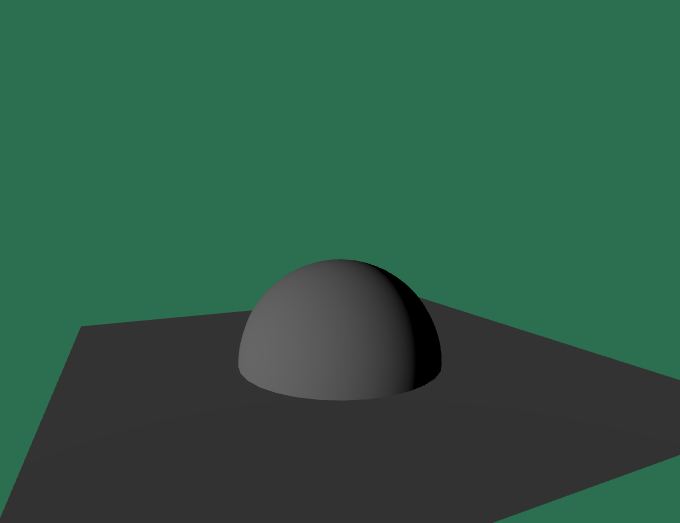
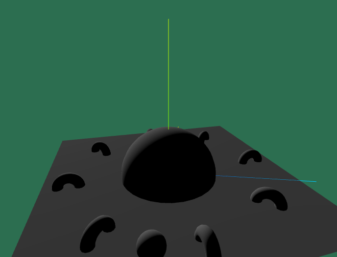
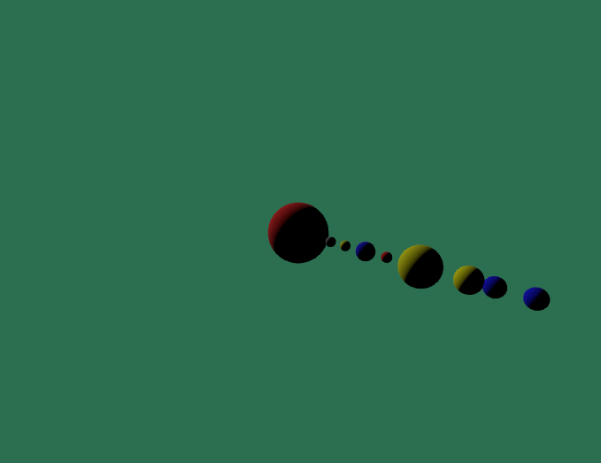
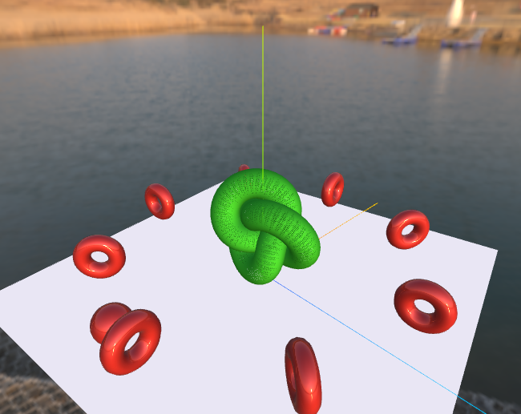
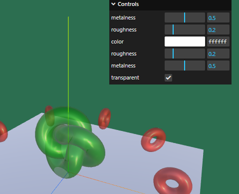
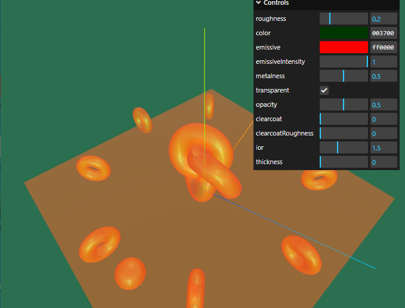

### 웹3D그래픽개발수업2일차 (threejs) 
  
2024-11-30  
  
#### x y z축 보이게 하기 
```
import * as THREE from 'three';
import './style.css'
import { OrbitControls } from 'three/addons/Addons.js';

class App {

  constructor() {
    this._setupThreeJs(); 
    this._setupCamera(); 
    this._setupLight(); 
    this._setupModel(); 
    this._setupEvent(); 
    this._setControls(); 
  }

  _setupThreeJs() {
    const divContainer = document.querySelector('#app');
    
    const renderer = new THREE.WebGLRenderer({ 
      antialias: true,
      powerPreference: "high-performance"
    });
    renderer.setPixelRatio(Math.min(window.devicePixelRatio, 2));
    divContainer.appendChild(renderer.domElement);
    this._divContainer = divContainer; 

    this._renderer = renderer;

    // Scene - 장면
    const scene = new THREE.Scene();
    scene.background = new THREE.Color("#2c6e50");  // scene의 배경색을 청록색으로
    this._scene = scene;
  }

  _setupCamera() { //카메라 
    const width = window.innerWidth; 
    const height = window.innerHeight; 
    const camera = new THREE.PerspectiveCamera(75, width / height, 0.1, 100); 
    camera.position.z = 3; 
    this._camera = camera; 
  }

  _setupLight() { //빛 - 조명
    const directionalLight = new THREE.DirectionalLight(0xffffff, 1); 
    directionalLight.position.set(1, 1, 4); 
    this._scene.add(directionalLight); 
  }

  _setControls() { //터치해서 3D구경하기 위한 메서드 
    this._controls = new OrbitControls(
      this._camera, 
      this._renderer.domElement
    ); //카메라와 돔객체. 마우스 이용 이벤트 돔객체 
  }

  _setupModel() {
    const axishelper = new THREE.AxesHelper(); 
    this._scene.add(axishelper); //z파랑 y초록 z빨강
  }

  update(){
    //const delta = this._clock.getDelta();
  }

  render(){
    requestAnimationFrame(this.render.bind(this));
    
    this.update();
    this._renderer.render(this._scene, this._camera);
  }

  _setupEvent(){
    let resizeTimeout;
    window.addEventListener("resize", () => {
      clearTimeout(resizeTimeout);
      resizeTimeout = setTimeout(() => this.resize(), 100);
    });
    
    this._clock = new THREE.Clock();
    this.resize();
  }

  resize(){
    const width = this._divContainer.clientWidth;
    const height = this._divContainer.clientHeight;

    this._camera.aspect = width / height; 
    this._camera.updateProjectionMatrix(); 
    
    this._renderer.setSize(width, height);
    this.render(); 
  }  
}

const app = new App();
```
  
#### _setupModel() 수정해서 바닥 위 반구 모양 만들기 
```
const material = new THREE.MeshStandardMaterial({color: "#aaaaaa"}); 
    const gromGround = new THREE.PlaneGeometry(5, 5); 
    const ground = new THREE.Mesh(gromGround, material); 
    this._scene.add(ground); 
    ground.rotation.x = THREE.MathUtils.degToRad(-90); 
    ground.position.y = -1; 

    const geomBigSphere = new THREE.SphereGeometry(1, 32, 16,0, THREE.MathUtils.degToRad(360),0, THREE.MathUtils.degToRad(90)); 
    const bigSphere = new THREE.Mesh(geomBigSphere, material); 
    this._scene.add(bigSphere);
    bigSphere.position.y = -1; 
```
  
  
  
#### 부모 자식 기준으로 회전 공 + 도넛 배치 만들기 
```
import * as THREE from 'three';
import './style.css'
import { OrbitControls } from 'three/addons/Addons.js';

class App {

  constructor() {
    this._setupThreeJs(); 
    this._setupCamera(); 
    this._setupLight(); 
    this._setupModel(); 
    this._setControls(); 
    this._setupEvent(); 
  }

  _setupThreeJs() {
    const divContainer = document.querySelector('#app');
    
    const renderer = new THREE.WebGLRenderer({ 
      antialias: true,
      powerPreference: "high-performance"
    });
    renderer.setPixelRatio(Math.min(window.devicePixelRatio, 2));
    divContainer.appendChild(renderer.domElement);
    this._divContainer = divContainer; 

    this._renderer = renderer;

    // Scene - 장면
    const scene = new THREE.Scene();
    scene.background = new THREE.Color("#2c6e50");  // scene의 배경색을 청록색으로
    this._scene = scene;
  }

  _setupCamera() { //카메라 
    const width = window.innerWidth; 
    const height = window.innerHeight; 
    const camera = new THREE.PerspectiveCamera(60, width / height, 0.1, 100); //60화각이 작을수록 외곡이 적다 
    camera.position.set(2, 2, 3.5); 
    this._camera = camera; 
  }

  _setupLight() { //빛 - 조명
    const directionalLight = new THREE.DirectionalLight(0xffffff, 1); 
    directionalLight.position.set(1, 1, 4); 
    this._scene.add(directionalLight); 
  }

  _setControls() { //터치해서 3D구경하기 위한 메서드 
    this._controls = new OrbitControls(
      this._camera, 
      this._renderer.domElement
    ); //카메라와 돔객체. 마우스 이용 이벤트 돔객체 
  }

  _setupModel() {
    const axishelper = new THREE.AxesHelper(3); 
    this._scene.add(axishelper); //z파랑 y초록 z빨강 
    this._axishelper = axishelper;
    axishelper.position.y = -1; 

    const material = new THREE.MeshStandardMaterial({color: "#aaaaaa"}); 
    const gromGround = new THREE.PlaneGeometry(5, 5); 
    const ground = new THREE.Mesh(gromGround, material); 
    this._scene.add(ground); //소환 
    ground.rotation.x = THREE.MathUtils.degToRad(-90); 
    ground.position.y = -1; 
    

    const geomBigSphere = new THREE.SphereGeometry(1, 32, 16,0, THREE.MathUtils.degToRad(360),0, THREE.MathUtils.degToRad(90)); 
    const bigSphere = new THREE.Mesh(geomBigSphere, material); 
    this._scene.add(bigSphere); //소환
    bigSphere.position.y = -1; 
  
    const geomSmallSphere = new THREE.SphereGeometry(0.2);
    const smallSphere = new THREE.Mesh(geomSmallSphere, material); 
    const smallSpherePivot = new THREE.Object3D(); 
    bigSphere.add(smallSpherePivot); //부모로 지정 
    smallSpherePivot.add(smallSphere); //자식으로 지정 
    smallSphere.position.x = -2; 
    smallSphere.position.y = 0.1; 

    this._smallSpherePivot = smallSpherePivot;
    this._smallSphere = smallSphere; 

    const cntItems = 8; 
    const geomTorus = new THREE.TorusGeometry(0.2, 0.1); 
    for(let i = 0; i < cntItems; i++){
      const torus = new THREE.Mesh(geomTorus, material); 
      const torusPivot = new THREE.Object3D(); 
      torusPivot.add(torus); 
      bigSphere.add(torusPivot); 
      torusPivot.rotation.y = THREE.MathUtils.degToRad(360) * i / cntItems; 
      torus.position.x = 2; //부모 -> 자식 기준으로 돈다 
    }
    
    
  }

  update() {
    const delta = this._clock.getDelta();
    
    this._smallSpherePivot.rotation.y += delta; 
    this._axishelper.rotation.y += delta; 
    this._controls.update();
  }
  
  render(){
    requestAnimationFrame(this.render.bind(this));
    
    this.update();
    this._renderer.render(this._scene, this._camera);
  }

  _setupEvent(){
    let resizeTimeout;
    window.addEventListener("resize", () => {
      clearTimeout(resizeTimeout);
      resizeTimeout = setTimeout(() => this.resize(), 100);
    });
    
    this._clock = new THREE.Clock();
    this.resize();
  }

  resize(){
    const width = this._divContainer.clientWidth;
    const height = this._divContainer.clientHeight;

    this._camera.aspect = width / height; 
    this._camera.updateProjectionMatrix(); 
    
    this._renderer.setSize(width, height);
    this.render(); 
  }  
}

const app = new App();
```
  
  
#### 태양계 만들기 
```
import * as THREE from 'three';
import './style.css'
import { OrbitControls } from 'three/addons/Addons.js';

class App {

  constructor() {
    this._setupThreeJs(); 
    this._setupCamera(); 
    this._setupLight(); 
    this._setupModel(); 
    this._setControls(); 
    this._setupEvent(); 
  }

  _setupThreeJs() {
    const divContainer = document.querySelector('#app');
    
    const renderer = new THREE.WebGLRenderer({ 
      antialias: true,
      powerPreference: "high-performance"
    });
    renderer.setPixelRatio(Math.min(window.devicePixelRatio, 2));
    divContainer.appendChild(renderer.domElement);
    this._divContainer = divContainer; 

    this._renderer = renderer;

    // Scene - 장면
    const scene = new THREE.Scene();
    scene.background = new THREE.Color("#2c6e50");  // scene의 배경색을 청록색으로
    this._scene = scene;
  }

  _setupCamera() { //카메라 
    const width = window.innerWidth; 
    const height = window.innerHeight; 
    const camera = new THREE.PerspectiveCamera(60, width / height, 0.1, 100); //60화각이 작을수록 외곡이 적다 
    camera.position.set(25, 1, 3.5); 
    this._camera = camera; 
  }

  _setupLight() { //빛 - 조명
    const directionalLight = new THREE.DirectionalLight(0xffffff, 1); 
    directionalLight.position.set(1, 1, 4); 
    this._scene.add(directionalLight); 
  }

  _setControls() { //터치해서 3D구경하기 위한 메서드 
    this._controls = new OrbitControls(
      this._camera, 
      this._renderer.domElement
    ); //카메라와 돔객체. 마우스 이용 이벤트 돔객체 
  }

  _setupModel() {
    const geometry_sun = new THREE.SphereGeometry(3); 
    const geometry_susung = new THREE.SphereGeometry(0.5); 
    const geometry_moon = new THREE.SphereGeometry(1); 
    const geometry_gigu = new THREE.SphereGeometry(0.9); 
    const geometry_mocsung = new THREE.SphereGeometry(1.9); 
    const geometry_tosung = new THREE.SphereGeometry(1.2); 
    const material_1 = new THREE.MeshStandardMaterial({color: "gray"}); 
    const material_2 = new THREE.MeshStandardMaterial({color: "red"}); 
    const material_3 = new THREE.MeshStandardMaterial({color: "blue", flatShading: true}); 
    const material_4 = new THREE.MeshStandardMaterial({color: "yellow"}); 


    const Sun = new THREE.Mesh(geometry_sun, material_2); 
    this._scene.add(Sun);
    this._sun = Sun;

    const Susung = new THREE.Mesh(geometry_susung, material_1); //선언 -> 모양,크기 + 색상 
    this._scene.add(Susung); //생성 
    Susung.position.x = 3.5; 
    this._gigu = Susung; //필드화 
    Sun.add(Susung);

    const Gigu = new THREE.Mesh(geometry_gigu, material_3); //선언 -> 모양,크기 + 색상 
    this._scene.add(Gigu); //생성 
    Gigu.position.x = 7; 
    this._gigu = Gigu; //필드화 
    Sun.add(Gigu); //부모요소 추가 

    const Gmesung = new THREE.Mesh(geometry_susung, material_4); //선언 -> 모양,크기 + 색상 
    this._scene.add(Gmesung); //생성 
    Gmesung.position.x = 5; 
    this._gigu = Gmesung; //필드화 
    Sun.add(Gmesung);

    const Hawsung = new THREE.Mesh(geometry_susung, material_2); //선언 -> 모양,크기 + 색상 
    this._scene.add(Hawsung); //생성 
    Hawsung.position.x = 9; 
    this._gigu = Hawsung; //필드화 
    Sun.add(Hawsung);

    const Mocsung = new THREE.Mesh(geometry_mocsung, material_4); 
    this._scene.add(Mocsung);
    Mocsung.position.x = 12; 
    this._moon = Mocsung; 
    Sun.add(Mocsung);

    const Tosung = new THREE.Mesh(geometry_tosung, material_4); 
    this._scene.add(Tosung);
    Tosung.position.x = 16; 
    this._moon = Tosung; 
    Sun.add(Tosung);

    const Chun = new THREE.Mesh(geometry_gigu, material_3); 
    this._scene.add(Chun);
    Chun.position.x = 18; 
    this._moon = Chun; 
    Sun.add(Chun);

    const Hea = new THREE.Mesh(geometry_gigu, material_3); 
    this._scene.add(Hea);
    Hea.position.x = 21; 
    this._moon = Hea; 
    Sun.add(Hea);

    //const Moon = new THREE.Mesh(geometry_moon, material_1); 
    //this._scene.add(Moon);
    //Moon.position.x = 30; 
    //this._moon = Moon; 
    //Sun.add(Moon);
  }

  update() {
    const delta = this._clock.getDelta();
    
    this._sun.rotation.y += delta;
    this._gigu.rotation.y += delta;
    this._moon.rotation.y += delta;
    this._controls.update();

  }
  
  render(){
    requestAnimationFrame(this.render.bind(this));
    
    this.update();
    this._renderer.render(this._scene, this._camera);
  }

  _setupEvent(){
    let resizeTimeout;
    window.addEventListener("resize", () => {
      clearTimeout(resizeTimeout);
      resizeTimeout = setTimeout(() => this.resize(), 100);
    });
    
    this._clock = new THREE.Clock();
    this.resize();
  }

  resize(){
    const width = this._divContainer.clientWidth;
    const height = this._divContainer.clientHeight;

    this._camera.aspect = width / height; 
    this._camera.updateProjectionMatrix(); 
    
    this._renderer.setSize(width, height);
    this.render(); 
  }  
}

const app = new App();
```
  
  
  
*** 
  
### 강사님 블로그 
[강사님블로그](http://www.gisdeveloper.co.kr/)  
  
### 3D Light광원 등의 효과 빛 Hdr 다운해서 적용 
https://polyhaven.com/  
https://polyhaven.com/hdris  
  
### 빛 배경 다운한 거 적용 + 다른 오브젝트 효과 넣기 
```
import * as THREE from 'three';
import './style.css'
import { OrbitControls, RGBELoader } from 'three/addons/Addons.js';

class App {

  constructor() {
    this._setupThreeJs(); 
    this._setupCamera(); 
    this._setupLight(); 
    this._setupModel(); 
    this._setControls(); 
    this._setupEvent(); 
  }

  _setupThreeJs() {
    const divContainer = document.querySelector('#app');
    
    const renderer = new THREE.WebGLRenderer({ 
      antialias: true,
      powerPreference: "high-performance"
    });
    renderer.setPixelRatio(Math.min(window.devicePixelRatio, 2));
    divContainer.appendChild(renderer.domElement);
    this._divContainer = divContainer; 

    this._renderer = renderer;

    // Scene - 장면
    const scene = new THREE.Scene();
    scene.background = new THREE.Color("#2c6e50");  // scene의 배경색을 청록색으로
    this._scene = scene;
  }

  _setupCamera() { //카메라 
    const width = window.innerWidth; 
    const height = window.innerHeight; 
    const camera = new THREE.PerspectiveCamera(60, width / height, 0.1, 100); //60화각이 작을수록 외곡이 적다 
    camera.position.set(2, 2, 3.5); 
    this._camera = camera; 
  }

  _setupLight() { //빛 - 조명
    //https://polyhaven.com/a/small_harbour_sunset에서 가져옴 
    const rgbeLoader = new RGBELoader();
    rgbeLoader.load("./small_harbour_sunset_1k.hdr", (env) => { 
        env.mapping = THREE.EquirectangularReflectionMapping; 
        this._scene.background = env; 
        this._scene.environment = env; 
    }); 
  }

  _setControls() { //터치해서 3D구경하기 위한 메서드 
    this._controls = new OrbitControls(
      this._camera, 
      this._renderer.domElement
    ); //카메라와 돔객체. 마우스 이용 이벤트 돔객체 
  }

  _setupModel() {
    const axishelper = new THREE.AxesHelper(3); 
    this._scene.add(axishelper); //z파랑 y초록 z빨강 
    this._axishelper = axishelper;
    axishelper.position.y = -1; 

    const material_1 = new THREE.MeshStandardMaterial({color: "white"}); 
    const material_2 = new THREE.MeshStandardMaterial({color: "green", wireframe: true}); 
    const material_3 = new THREE.MeshStandardMaterial({color: "brown", metalness: 0.5, roughness: 0}); 
    const material = new THREE.MeshStandardMaterial({color: "#FFFFFF"}); 
    const gromGround = new THREE.PlaneGeometry(5, 5); 
    const ground = new THREE.Mesh(gromGround, material_1); 
    this._scene.add(ground); //소환 
    ground.rotation.x = THREE.MathUtils.degToRad(-90); 
    ground.position.y = -1; 
    

    const geomBigSphere = new THREE.TorusKnotGeometry(0.4, 0.18, 128, 64); 
    const bigSphere = new THREE.Mesh(geomBigSphere, material_2); 
    this._scene.add(bigSphere); //소환
    bigSphere.position.y = -0.3; 
  
    const geomSmallSphere = new THREE.SphereGeometry(0.2);
    const smallSphere = new THREE.Mesh(geomSmallSphere, material_3); 
    const smallSpherePivot = new THREE.Object3D(); 
    bigSphere.add(smallSpherePivot); //부모로 지정 
    smallSpherePivot.add(smallSphere); //자식으로 지정 
    smallSphere.position.x = -2; 
    smallSphere.position.y = -0.2; 

    this._smallSpherePivot = smallSpherePivot;
    this._smallSphere = smallSphere; 

    const cntItems = 8; 
    const geomTorus = new THREE.TorusGeometry(0.2, 0.1); 
    for(let i = 0; i < cntItems; i++){
      const torus = new THREE.Mesh(geomTorus, material_3); 
      const torusPivot = new THREE.Object3D(); 
      torusPivot.add(torus); 
      bigSphere.add(torusPivot); 
      torusPivot.rotation.y = THREE.MathUtils.degToRad(360) * i / cntItems; 
      torus.position.set(2, -0.2, 0);
    }
    
    
  }

  update() {
    const delta = this._clock.getDelta();
    
    this._smallSpherePivot.rotation.y += delta; 
    this._axishelper.rotation.y += delta; 
    this._controls.update();
  }
  
  render(){
    requestAnimationFrame(this.render.bind(this));
    
    this.update();
    this._renderer.render(this._scene, this._camera);
  }

  _setupEvent(){
    let resizeTimeout;
    window.addEventListener("resize", () => {
      clearTimeout(resizeTimeout);
      resizeTimeout = setTimeout(() => this.resize(), 100);
    });
    
    this._clock = new THREE.Clock();
    this.resize();
  }

  resize(){
    const width = this._divContainer.clientWidth;
    const height = this._divContainer.clientHeight;

    this._camera.aspect = width / height; 
    this._camera.updateProjectionMatrix(); 
    
    this._renderer.setSize(width, height);
    this.render(); 
  }  
}

const app = new App();
```
  
  
  
#### 위 수정사항 
import와    
```
const rgbeLoader = new RGBELoader();
    rgbeLoader.load("./small_harbour_sunset_1k.hdr", (env) => { 
        env.mapping = THREE.EquirectangularReflectionMapping; 
        this._scene.background = env; 
        this._scene.environment = env; 
    }); 
```
```
const material_1 = new THREE.MeshStandardMaterial({color: "white"}); 
    const material_2 = new THREE.MeshStandardMaterial({color: "green", wireframe: true}); 
    const material_3 = new THREE.MeshStandardMaterial({color: "brown", metalness: 0.5, roughness: 0}); 
    const material = new THREE.MeshStandardMaterial({color: "#FFFFFF"}); 
```
#### 이렇게 하면 빛만 이쁘게 나옴 
```
const rgbeLoader = new RGBELoader();
    rgbeLoader.load("./small_harbour_sunset_1k.hdr", (env) => { 
        env.mapping = THREE.EquirectangularReflectionMapping; 
        //this._scene.background = env; 
        this._scene.environment = env; 
    }); 
```
  
#### GUI import로 대략 효과 넣기 
import { GUI } from 'three/addons/libs/lil-gui.module.min.js'; 하면  
```
    const gui = new GUI(); 
    gui.add(material_1, "metalness").min(0).max(1).step(0.01); 
    gui.add(material_1, "roughness").min(0).max(1).step(0.01); 
    gui.addColor(material_1, "color"); 
    gui.add(material_2, "roughness").min(0).max(1).step(0.01); 
    gui.add(material_2, "metalness").min(0).max(1).step(0.01); 
    gui.add(material_2, "transparent").min(0).max(1).step(0.01); 
```

  

#### 유리재질 가깝게 표현 + GUI로 웹 조정 
```
import * as THREE from 'three';
import './style.css'
import { OrbitControls, RGBELoader } from 'three/addons/Addons.js';
import { GUI } from 'three/addons/libs/lil-gui.module.min.js';

class App {

  constructor() {
    this._setupThreeJs(); 
    this._setupCamera(); 
    this._setupLight(); 
    this._setupModel(); 
    this._setControls(); 
    this._setupEvent(); 
  }

  _setupThreeJs() {
    const divContainer = document.querySelector('#app');
    
    const renderer = new THREE.WebGLRenderer({ 
      antialias: true,
      powerPreference: "high-performance"
    });
    renderer.setPixelRatio(Math.min(window.devicePixelRatio, 2));
    divContainer.appendChild(renderer.domElement);
    this._divContainer = divContainer; 

    this._renderer = renderer;

    // Scene - 장면
    const scene = new THREE.Scene();
    scene.background = new THREE.Color("#2c6e50");  // scene의 배경색을 청록색으로
    this._scene = scene;
  }

  _setupCamera() { //카메라 
    const width = window.innerWidth; 
    const height = window.innerHeight; 
    const camera = new THREE.PerspectiveCamera(60, width / height, 0.1, 100); //60화각이 작을수록 외곡이 적다 
    camera.position.set(2, 2, 3.5); 
    this._camera = camera; 
  }

  _setupLight() { //빛 - 조명
    //https://polyhaven.com/a/small_harbour_sunset에서 가져옴 
    const rgbeLoader = new RGBELoader();
    rgbeLoader.load("./small_harbour_sunset_1k.hdr", (env) => { 
        env.mapping = THREE.EquirectangularReflectionMapping; 
        //this._scene.background = env; 
        this._scene.environment = env; 
    }); 
  }

  _setControls() { //터치해서 3D구경하기 위한 메서드 
    this._controls = new OrbitControls(
      this._camera, 
      this._renderer.domElement
    ); //카메라와 돔객체. 마우스 이용 이벤트 돔객체 
  }

  _setupModel() {
    
    const axishelper = new THREE.AxesHelper(3); 
    this._scene.add(axishelper); //z파랑 y초록 z빨강 
    this._axishelper = axishelper;
    axishelper.position.y = -1; 


    const material_2 = new THREE.MeshPhysicalMaterial({
        color: "green", 
        transparent: true, 
        side: THREE.DoubleSide, 
        opacity: 0.5, 
        roughness: 0.2, 
        metalness: 0.5, 
        clearcoat: 0,
        emissive: "red", 
    }); 

    const gui = new GUI(); 
    gui.add(material_2, "roughness").min(0).max(1).step(0.01); 
    gui.addColor(material_2, "color"); 
    gui.addColor(material_2, "emissive"); 
    gui.add(material_2, "emissiveIntensity").min(0).max(1).step(0.01); 
    gui.add(material_2, "metalness").min(0).max(1).step(0.01); 
    gui.add(material_2, "transparent"); 
    gui.add(material_2, "opacity").min(0).max(1).step(0.01); 
    gui.add(material_2, "clearcoat").min(0).max(1).step(0.01);  
    gui.add(material_2, "clearcoatRoughness").min(0).max(1).step(0.01);  
    gui.add(material_2, "ior").min(1).max(2.333).step(0.01);  
    gui.add(material_2, "thickness").min(0).max(5).step(0.01);  


    const gromGround = new THREE.PlaneGeometry(5, 5); 
    const ground = new THREE.Mesh(gromGround, material_2); 
    this._scene.add(ground); //소환 
    ground.rotation.x = THREE.MathUtils.degToRad(-90); 
    ground.position.y = -1; 
    

    const geomBigSphere = new THREE.TorusKnotGeometry(0.4, 0.18, 128, 64); 
    const bigSphere = new THREE.Mesh(geomBigSphere, material_2); 
    this._scene.add(bigSphere); //소환
    bigSphere.position.y = -0.3; 
  
    const geomSmallSphere = new THREE.SphereGeometry(0.2);
    const smallSphere = new THREE.Mesh(geomSmallSphere, material_2); 
    const smallSpherePivot = new THREE.Object3D(); 
    bigSphere.add(smallSpherePivot); //부모로 지정 
    smallSpherePivot.add(smallSphere); //자식으로 지정 
    smallSphere.position.x = -2; 
    smallSphere.position.y = -0.2; 

    this._smallSpherePivot = smallSpherePivot;
    this._smallSphere = smallSphere; 

    const cntItems = 8; 
    const geomTorus = new THREE.TorusGeometry(0.2, 0.1); 
    for(let i = 0; i < cntItems; i++){
      const torus = new THREE.Mesh(geomTorus, material_2); 
      const torusPivot = new THREE.Object3D(); 
      torusPivot.add(torus); 
      bigSphere.add(torusPivot); 
      torusPivot.rotation.y = THREE.MathUtils.degToRad(360) * i / cntItems; 
      torus.position.set(2, -0.2, 0);
    }
    
    
  }

  update() {
    const delta = this._clock.getDelta();
    
    this._smallSpherePivot.rotation.y += delta; 
    this._axishelper.rotation.y += delta; 
    this._controls.update();
  }
  
  render(){
    requestAnimationFrame(this.render.bind(this));
    
    this.update();
    this._renderer.render(this._scene, this._camera);
  }

  _setupEvent(){
    let resizeTimeout;
    window.addEventListener("resize", () => {
      clearTimeout(resizeTimeout);
      resizeTimeout = setTimeout(() => this.resize(), 100);
    });
    
    this._clock = new THREE.Clock();
    this.resize();
  }

  resize(){
    const width = this._divContainer.clientWidth;
    const height = this._divContainer.clientHeight;

    this._camera.aspect = width / height; 
    this._camera.updateProjectionMatrix(); 
    
    this._renderer.setSize(width, height);
    this.render(); 
  }  
}

const app = new App();
```
#### 그 중 수정사항만 
```
    const material_2 = new THREE.MeshPhysicalMaterial({
        color: "green", 
        transparent: true, 
        side: THREE.DoubleSide, 
        opacity: 0.5, 
        roughness: 0.2, 
        metalness: 0.5, 
        clearcoat: 0,
        emissive: "red", 
    }); 

    const gui = new GUI(); 
    gui.add(material_2, "roughness").min(0).max(1).step(0.01); 
    gui.addColor(material_2, "color"); 
    gui.addColor(material_2, "emissive"); 
    gui.add(material_2, "emissiveIntensity").min(0).max(1).step(0.01); 
    gui.add(material_2, "metalness").min(0).max(1).step(0.01); 
    gui.add(material_2, "transparent"); 
    gui.add(material_2, "opacity").min(0).max(1).step(0.01); 
    gui.add(material_2, "clearcoat").min(0).max(1).step(0.01);  
    gui.add(material_2, "clearcoatRoughness").min(0).max(1).step(0.01);  
    gui.add(material_2, "ior").min(1).max(2.333).step(0.01);  
    gui.add(material_2, "thickness").min(0).max(5).step(0.01);  

```
  
  
*** 
  
#### 메터리얼 텍스처 사이트 
[메터리얼 텍스처 사이트](https://3dtextures.me/)  
  
```
import * as THREE from 'three';
import './style.css'
import { OrbitControls, RGBELoader } from 'three/addons/Addons.js';

class App {

  constructor() {
    this._setupThreeJs(); 
    this._setupCamera(); 
    this._setupLight(); 
    this._setupModel(); 
    this._setupEvent(); 
    this._setupModel_map();
    this._setupModel_map2();
    this._setControls(); 
  }

  _setupThreeJs() {
    const divContainer = document.querySelector('#app');
    
    const renderer = new THREE.WebGLRenderer({ 
      antialias: true,
      powerPreference: "high-performance"
    });
    renderer.setPixelRatio(Math.min(window.devicePixelRatio, 2));
    divContainer.appendChild(renderer.domElement);
    this._divContainer = divContainer; 

    this._renderer = renderer;

    // Scene - 장면
    const scene = new THREE.Scene();
    scene.background = new THREE.Color("#2c6e50");  // scene의 배경색을 청록색으로
    this._scene = scene;

    // 조명 추가
    const ambientLight = new THREE.AmbientLight(0xffffff, 1); // 환경광 강도 증가
    scene.add(ambientLight);

    const directionalLight = new THREE.DirectionalLight(0xffffff, 2); // 직사광 강도 증가
    directionalLight.position.set(2, 2, 2);
    scene.add(directionalLight);
  }

  _setupCamera() { //카메라 
    const width = window.innerWidth; 
    const height = window.innerHeight; 
    const camera = new THREE.PerspectiveCamera(120, width / height, 0.1, 100); 
    camera.position.z = 3; 
    this._camera = camera; 
  }

  _setupLight() { //빛 - 조명
    const rgbeLoader = new RGBELoader();
    rgbeLoader.load("./small_harbour_sunset_1k.hdr", (env) => { 
        env.mapping = THREE.EquirectangularReflectionMapping; 
        this._scene.background = env; 
        this._scene.environment = env; 
    }); 
  }

  _setControls() { //터치해서 3D구경하기 위한 메서드 
    this._controls = new OrbitControls(
      this._camera, 
      this._renderer.domElement
    ); //카메라와 돔객체. 마우스 이용 이벤트 돔객체 
  }

  _setupModel() {
    
  }

  _setupModel_map() {
  }

  _setupModel_map2() {
    const textureLoader = new THREE.TextureLoader();
    const map = textureLoader.load("./Glass_Window_002_basecolor.jpg");
    map.colorSpace = THREE.SRGBColorSpace; //RGB로 이미지색 그대로 표시


    const mapMetallic = textureLoader.load("./Glass_Window_002_metallic.jpg");
    const mapRoughness = textureLoader.load("./Glass_Window_002_roughness.jpg");
    const mapNormal = textureLoader.load("./Glass_Window_002_normal.jpg");
    const mapHeight = textureLoader.load("./Glass_Window_002_height.png");
    const mapAO = textureLoader.load("./Glass_Window_002_ambientOcclusion.jpg");
    const mapAlpha = textureLoader.load("./Glass_Window_002_opacity.jpg");

    const material = new THREE.MeshStandardMaterial({

    roughness: 0.1,  // 매끈한 효과
    metalness: 0.8,  // 금속성 증가

    map: map, 
    mapMetallic: mapMetallic,
    mapRoughness: mapRoughness,

    normalMap: mapNormal,

    displacementMap: mapHeight, // 돌출사진 
    displacementScale: 0.1,  
    displacementBias: -0.08,   
    normalScale: new THREE.Vector2(2, 2),  // 노말맵 강도 증가
    
    aoMap: mapAO,
    aoMapIntensity: 1.5,

    alphaMap: mapAlpha,
    transparent: true,
    
    side: THREE.DoubleSide,
  });

    const geomBox = new THREE.BoxGeometry(1.5, 1.5, 1.5); 
    const box = new THREE.Mesh(geomBox, material); 
    this._scene.add(box); 

    const loader = new THREE.SphereGeometry(1);
    const sphere = new THREE.Mesh(loader, material);
    sphere.position.x = 2;
    this._scene.add(sphere);
  }

  update(){
    
  }

  render(){
    requestAnimationFrame(this.render.bind(this));
    
    this.update();
    this._renderer.render(this._scene, this._camera);
  }

  _setupEvent(){
    let resizeTimeout;
    window.addEventListener("resize", () => {
      clearTimeout(resizeTimeout);
      resizeTimeout = setTimeout(() => this.resize(), 100);
    });
    
    this._clock = new THREE.Clock();
    this.resize();
  }

  resize(){
    const width = this._divContainer.clientWidth;
    const height = this._divContainer.clientHeight;

    this._camera.aspect = width / height; 
    this._camera.updateProjectionMatrix(); 
    
    this._renderer.setSize(width, height);
    this.render(); 
  }  
}

const app = new App();
```
  
#### Light 속성 소개 
HemisphereLight, AmbientLight, RGBELoader 등 많음  
DirectionalLight는 태양 빛 등..  
  
```
const directionalLight = new THREE.DirectionalLight("#ffffff", 5); 
    directionalLight.position.set(1, 1, 1); 
    this._scene.add(directionalLight); 
```
  
#### 캐릭터 import해서 구현 - 걷기 달리기 선택 
```
import * as THREE from 'three';
import './style.css'
import { OrbitControls, GLTFLoader } from 'three/addons/Addons.js';
import GUI from 'three/addons/libs/lil-gui.module.min.js';

class App {

  constructor() {
    this._setupThreeJs(); 
    this._setupCamera(); 
    this._setupLight(); 
    this._setupModel(); 
    this._setupEvent(); 
    this._setControls(); 
  }

  _setupThreeJs() {
    const divContainer = document.querySelector('#app');
    
    const renderer = new THREE.WebGLRenderer({ 
      antialias: true,
      powerPreference: "high-performance"
    });
    renderer.setPixelRatio(Math.min(window.devicePixelRatio, 2));
    divContainer.appendChild(renderer.domElement);
    this._divContainer = divContainer; 

    this._renderer = renderer;

    // Scene - 장면
    const scene = new THREE.Scene();
    scene.background = new THREE.Color("#2c6e50");  // scene의 배경색을 청록색으로
    this._scene = scene;
  }

  _setupCamera() { //카메라 
    const width = window.innerWidth; 
    const height = window.innerHeight; 
    const camera = new THREE.PerspectiveCamera(75, width / height, 0.1, 100); 
    camera.position.set(0, 1.6, 1.5); 
    this._camera = camera; 
  }

  _setupLight() { //빛 - 조명
    const directionalLight = new THREE.DirectionalLight(0xffffff, 1); 
    directionalLight.position.set(1, 1, 4); 
    this._scene.add(directionalLight); 
  }

  _setControls() { //터치해서 3D구경하기 위한 메서드 
    this._controls = new OrbitControls(
      this._camera, 
      this._renderer.domElement
    ); //카메라와 돔객체. 마우스 이용 이벤트 돔객체 
    this._controls.target.set(0, 1, 0); 
    this._controls.enableDamping = true; 
  }

  _setupModel() {
    const Loader = new GLTFLoader(); 
    Loader.load("./character.glb", (gltf) => {
      this._scene.add(gltf.scene); 
      
      console.log(gltf.animations); 
      const animationNames = gltf.animations.map(
        (animation) => animation.name
      ); 
      console.log(animationNames); 

      const gui = new GUI(); 
      const prop = { 
        animationName: animationNames[0], 
      }
      gui.add(prop, "animationName", animationNames).onChange((v)=> {
        console.log(v); 
        play(v); 
      }); 

      this._mixer = new THREE.AnimationMixer(gltf.scene); //믹서해주는 거 선언 

      const play = (animationName) => {
        if(this._currentAction) {
          //this._currentAction.stop(); //갑자기 멈춤 
          this._currentAction.fadeOut(0.5); //서서히 멈춤 
        }
          console.log(animationName + " 애니메이션을 플레이해보자"); 
          const i = animationNames.indexOf(animationName); 
          const clip = gltf.animations[i]; 
          const action = this._mixer.clipAction(clip); 

          action.reset().fadeIn(0.5).play(); //서서히 시작 
          this._currentAction = action; 
      };
      play(prop.animationName); 
    }); 
  }

  update(){
    const delta = this._clock.getDelta(); 
    if(this._mixer) {
      this._mixer.update(delta); 
    }
  }

  render(){
    requestAnimationFrame(this.render.bind(this));
    
    this.update();
    this._renderer.render(this._scene, this._camera);
  }

  _setupEvent(){
    let resizeTimeout;
    window.addEventListener("resize", () => {
      clearTimeout(resizeTimeout);
      resizeTimeout = setTimeout(() => this.resize(), 100);
    });
    
    this._clock = new THREE.Clock();
    this.resize();
  }

  resize(){
    const width = this._divContainer.clientWidth;
    const height = this._divContainer.clientHeight;

    this._camera.aspect = width / height; 
    this._camera.updateProjectionMatrix(); 
    
    this._renderer.setSize(width, height);
    this.render(); 
  }  
}

const app = new App();
```

#### 모델 얻는 곳 
https://readyplayer.me/  
https://www.mixamo.com/  
  
### 물리엔진 구현 - 특히 리지드바디 
cmd명령: npm i @dimforge/rapier3d-compat  

#### 웹으로 리지드바디 물리엔진 구현 
```
import "./style.css";
import * as THREE from "three";
import { OrbitControls } from "three/addons/controls/OrbitControls.js";
import RAPIER from "@dimforge/rapier3d-compat";

class RapierDebugRenderer {
  constructor(scene, world) {
    this._world = world;
    this._mesh = new THREE.LineSegments(
      new THREE.BufferGeometry(),
      new THREE.LineBasicMaterial({ color: 0xffffff, vertexColors: true })
    );
    this._mesh.frustumCulled = false;
    scene.add(this._mesh);
  }

  update() {
    const { vertices, colors } = this._world.debugRender();
    this._mesh.geometry.setAttribute(
      "position",
      new THREE.BufferAttribute(vertices, 3)
    );
    this._mesh.geometry.setAttribute(
      "color",
      new THREE.BufferAttribute(colors, 4)
    );
    this._mesh.visible = true;
  }
}

export default class App {
  constructor() {
    RAPIER.init().then(() => {
      const world = new RAPIER.World(new RAPIER.Vector3(0, -9.81, 0));
      this._world = world;

      this._setupThreeJs();
      this._setupCamera();
      this._setupLight();
      this._setupControls();
      this._setupModel();
      this._setupEvents();

      this._debug = new RapierDebugRenderer(this._scene, this._world);
    });
  }

  _setupThreeJs() {
    const divContainer = document.querySelector("#app");
    this._divContainer = divContainer;
    let renderer = new THREE.WebGLRenderer({ antialias: true });
    renderer.setClearColor(new THREE.Color("#2c3e50"), 1);
    renderer.setPixelRatio(window.devicePixelRatio);

    renderer.shadowMap.enabled = true;
    renderer.shadowMap.type = THREE.VSMShadowMap;

    divContainer.appendChild(renderer.domElement);

    this._renderer = renderer;
    const scene = new THREE.Scene();
    this._scene = scene;
  }

  _setupCamera() {
    const width = this._divContainer.clientWidth;
    const height = this._divContainer.clientHeight;
    const camera = new THREE.PerspectiveCamera(60, width / height, 0.1, 100);
    camera.position.set(0, 2, 20);
    this._camera = camera;
  }

  _setupLight() {
    const light1 = new THREE.SpotLight(undefined, Math.PI * 10);
    light1.position.set(2.5, 5, 5);
    light1.angle = Math.PI / 3;
    light1.penumbra = 0.5;
    light1.castShadow = true;
    light1.shadow.blurSamples = 10;
    light1.shadow.radius = 5;
    this._scene.add(light1);

    const light2 = light1.clone();
    light2.position.set(-2.5, 5, 5);
    this._scene.add(light2);
  }

  _setupModel() {
    const dynamicBodies = [];
    this._dynamicBodies = dynamicBodies;

    const material = new THREE.MeshStandardMaterial({
      metalness: 0.5,
      roughness: 0,
    });

    // Cuboid Collider
    const cubeMesh = new THREE.Mesh(new THREE.BoxGeometry(1, 1, 1), material);
    cubeMesh.castShadow = true;
    this._scene.add(cubeMesh);
    const cubeBody = this._world.createRigidBody(
      RAPIER.RigidBodyDesc.dynamic().setTranslation(-5, 5, 0).setCanSleep(false)
    );
    const cubeShape = RAPIER.ColliderDesc.cuboid(0.5, 0.5, 0.5)
      .setMass(1)
      .setRestitution(1.1);
    this._world.createCollider(cubeShape, cubeBody);
    dynamicBodies.push([cubeMesh, cubeBody]);

    // Ball Collider
    const sphereMesh = new THREE.Mesh(new THREE.SphereGeometry(), material);
    sphereMesh.castShadow = true;
    this._scene.add(sphereMesh);
    const sphereBody = this._world.createRigidBody(
      RAPIER.RigidBodyDesc.dynamic()
        .setTranslation(-2.5, 5, 0)
        .setCanSleep(false)
    );
    const sphereShape = RAPIER.ColliderDesc.ball(1)
      .setMass(1)
      .setRestitution(1.1);
    this._world.createCollider(sphereShape, sphereBody);
    dynamicBodies.push([sphereMesh, sphereBody]);

    // Cylinder Collider
    const cylinderMesh = new THREE.Mesh(
      new THREE.CylinderGeometry(1, 1, 2, 16),
      material
    );
    cylinderMesh.castShadow = true;
    this._scene.add(cylinderMesh);
    const cylinderBody = this._world.createRigidBody(
      RAPIER.RigidBodyDesc.dynamic().setTranslation(0, 5, 0).setCanSleep(false)
    );
    const cylinderShape = RAPIER.ColliderDesc.cylinder(1, 1)
      .setMass(1)
      .setRestitution(1.1);
    this._world.createCollider(cylinderShape, cylinderBody);
    dynamicBodies.push([cylinderMesh, cylinderBody]);

    // ConvexHull Collider
    const icosahedronMesh = new THREE.Mesh(
      new THREE.TorusKnotGeometry(),
      material
    );
    icosahedronMesh.castShadow = true;
    this._scene.add(icosahedronMesh);
    const icosahedronBody = this._world.createRigidBody(
      RAPIER.RigidBodyDesc.dynamic()
        .setTranslation(2.5, 5, 0)
        .setCanSleep(false)
    );
    const points = new Float32Array(
      icosahedronMesh.geometry.attributes.position.array
    );
    const icosahedronShape = RAPIER.ColliderDesc.convexHull(points)
      .setMass(1)
      .setRestitution(1.1);
    this._world.createCollider(icosahedronShape, icosahedronBody);
    dynamicBodies.push([icosahedronMesh, icosahedronBody]);

    // Trimesh Collider
    const torusKnotMesh = new THREE.Mesh(
      new THREE.TorusKnotGeometry(),
      material
    );
    torusKnotMesh.castShadow = true;
    this._scene.add(torusKnotMesh);
    const torusKnotBody = this._world.createRigidBody(
      RAPIER.RigidBodyDesc.dynamic().setTranslation(5, 5, 0).setCanSleep(false)
    );
    const vertices = new Float32Array(
      torusKnotMesh.geometry.attributes.position.array
    );
    let indices = new Uint32Array(torusKnotMesh.geometry.index.array);
    const torusKnotShape = RAPIER.ColliderDesc.trimesh(vertices, indices)
      .setMass(1)
      .setRestitution(1.1);
    this._world.createCollider(torusKnotShape, torusKnotBody);
    dynamicBodies.push([torusKnotMesh, torusKnotBody]);

    const floorMesh = new THREE.Mesh(
      new THREE.BoxGeometry(100, 1, 100),
      material
    );
    floorMesh.receiveShadow = true;
    floorMesh.position.y = -1;
    this._scene.add(floorMesh);
    const floorBody = this._world.createRigidBody(
      RAPIER.RigidBodyDesc.fixed().setTranslation(0, -1, 0)
    );
    const floorShape = RAPIER.ColliderDesc.cuboid(50, 0.5, 50);
    this._world.createCollider(floorShape, floorBody);
  }

  _setupControls() {
    this._orbitControls = new OrbitControls(this._camera, this._divContainer);
  }

  _setupEvents() {
    window.onresize = this.resize.bind(this);
    this.resize();

    this._clock = new THREE.Clock();
    requestAnimationFrame(this.render.bind(this));

    const raycaster = new THREE.Raycaster();
    const mouse = new THREE.Vector2();

    this._divContainer.addEventListener("click", (e) => {
      mouse.set(
        (e.clientX / this._divContainer.clientWidth) * 2 - 1,
        -(e.clientY / this._divContainer.clientHeight) * 2 + 1
      );

      raycaster.setFromCamera(mouse, this._camera);
      const targetObjs = this._dynamicBodies.flatMap((a) => a[0]);
      const intersects = raycaster.intersectObjects(targetObjs);

      if (intersects.length) {
        this._dynamicBodies.forEach((b) => {
          if (b[0] === intersects[0].object)
            b[1].applyImpulse(new RAPIER.Vector3(0, 5, 0), true);
        });
      }
    });
  }

  update() {
    const delta = this._clock.getDelta();

    this._world.timestep = Math.min(delta, 0.1);
    this._world.step();

    const dynamicBodies = this._dynamicBodies;
    for (let i = 0, n = dynamicBodies.length; i < n; i++) {
      dynamicBodies[i][0].position.copy(dynamicBodies[i][1].translation());
      dynamicBodies[i][0].quaternion.copy(dynamicBodies[i][1].rotation());
    }

    if (this._debug) this._debug.update();

    this._orbitControls.update();
  }

  render() {
    this.update();

    this._renderer.render(this._scene, this._camera);

    requestAnimationFrame(this.render.bind(this));
  }

  resize() {
    const width = this._divContainer.clientWidth;
    const height = this._divContainer.clientHeight;

    this._camera.aspect = width / height;
    this._camera.updateProjectionMatrix();

    this._renderer.setSize(width, height);
  }
}
const app = new App();
```
