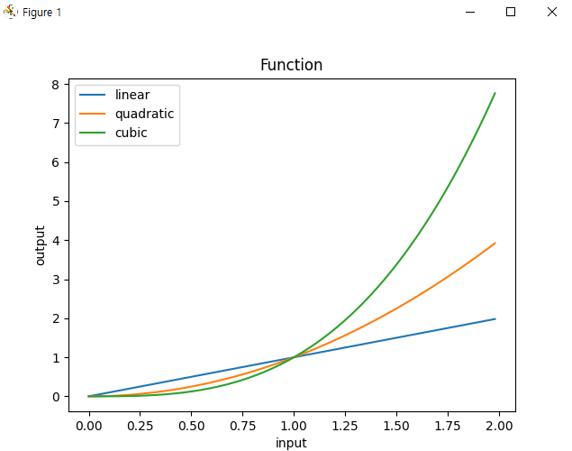

### 파이썬으로 그래프 만들기 
  
vs cmd 명령: pip install matplotlib  
  
#### 그래프 그리는 명령 
```
import matplotlib.pyplot as plt 
X = [1,2,3,4,5,6,7]
Y = [15.6, 12.5, 2.6, 12.6, 45.8,5.8,4.8] 

plt.plot(X,Y)
plt.show()
``` 
  
시험문제: csv파일 주면 그걸로 그래프 그리기  
  
#### 그래프 그리는 거  
```
import matplotlib.pyplot as plt 
X = ["Mon", "Tue", "Wed", "Thur", "Fri", "Sat", "Sun"]
Y1 = [11.0,25.0,3.5,49.21,10.4,6.0,7.0]
Y2 = [15.6, 12.5, 2.6, 12.6, 45.8,5.8,4.8] 

plt.plot(X,Y1, label="Seoul")
plt.plot(X,Y2, label="Busan")

plt.xlabel("day")
plt.ylabel("temperature") 
plt.legend(loc="upper left")
plt.title("Temperatures of Cities")
plt.show()
```
  
#### 3단 그래프 코드 
```
import matplotlib.pyplot as plt 

x,y,z = [], [], []
for i in range(100): 
  x.append(i/50.0)
for i in x: 
  y.append(i**2)
for i in x: 
  z.append(i**3) 

plt.plot(x,x, label="linear")
plt.plot(x,y, label="quadratic")
plt.plot(x,z, label="cubic")

plt.xlabel("input") 
plt.ylabel("output") 
plt.legend(loc="upper left") # 레전드 
plt.title("Function") # 제목 
plt.show()
```
  
#### 3단 그래프 결과 이미지 
  
  
#### 원형 파이그래프 + 파이 하나 띄워 표시 
```
import matplotlib.pyplot as plt 

Y = [40,20,10,30] 
labels = ["Eating Out", "Shopping", "Groceries", "Housing"]
explode = [0.1,0,0,0] #처음꺼 0.1만큼 띄우기 explode

plt.pie(Y, labels=labels, explode=explode)
plt.show()
```
  
  
  
### 그림 만화처럼 텍스처화 등 

cmd명령: pip install opencv-python  
  
```
import cv2 

img1 = cv2.imread('flo.jpg', cv2.IMREAD_COLOR)

img2 = cv2.stylization(img1, sigma_s=100, sigma_r=0.9) 

cv2.imshow('original', img1)
cv2.imshow('result', img2)

cv2.waitKey(0)
cv2.destroyAllWindows() 

cv2.imwrite('result1.jpg', img2)

```
이미지만 잘 있으면 될 것  
  
