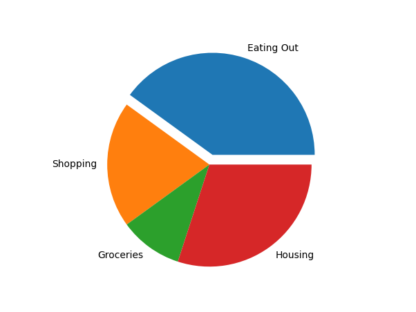
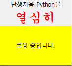
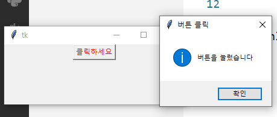
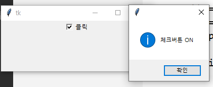
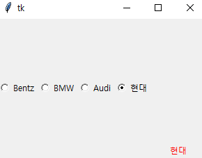

### 파이썬으로 그래프 만들기 
  
vs cmd 명령: pip install matplotlib  
  
#### 그래프 그리는 명령 
```
import matplotlib.pyplot as plt 
X = [1,2,3,4,5,6,7]
Y = [15.6, 12.5, 2.6, 12.6, 45.8,5.8,4.8] 

plt.plot(X,Y)
plt.show()
``` 
  
시험문제: csv파일 주면 그걸로 그래프 그리기  
  
#### 그래프 그리는 거  
```
import matplotlib.pyplot as plt 
X = ["Mon", "Tue", "Wed", "Thur", "Fri", "Sat", "Sun"]
Y1 = [11.0,25.0,3.5,49.21,10.4,6.0,7.0]
Y2 = [15.6, 12.5, 2.6, 12.6, 45.8,5.8,4.8] 

plt.plot(X,Y1, label="Seoul")
plt.plot(X,Y2, label="Busan")

plt.xlabel("day")
plt.ylabel("temperature") 
plt.legend(loc="upper left")
plt.title("Temperatures of Cities")
plt.show()
```
  
#### 3단 그래프 코드 
```
import matplotlib.pyplot as plt 

x,y,z = [], [], []
for i in range(100): 
  x.append(i/50.0)
for i in x: 
  y.append(i**2)
for i in x: 
  z.append(i**3) 

plt.plot(x,x, label="linear")
plt.plot(x,y, label="quadratic")
plt.plot(x,z, label="cubic")

plt.xlabel("input") 
plt.ylabel("output") 
plt.legend(loc="upper left") # 레전드 
plt.title("Function") # 제목 
plt.show()
```
  
#### 3단 그래프 결과 이미지 
  
  
#### 원형 파이그래프 + 파이 하나 띄워 표시 
```
import matplotlib.pyplot as plt 

Y = [40,20,10,30] 
labels = ["Eating Out", "Shopping", "Groceries", "Housing"]
explode = [0.1,0,0,0] #처음꺼 0.1만큼 띄우기 explode

plt.pie(Y, labels=labels, explode=explode)
plt.show()
```
  
  
  
### 그림 만화처럼 텍스처화 등 

cmd명령: pip install opencv-python  
  
```
import cv2 

img1 = cv2.imread('flo.jpg', cv2.IMREAD_COLOR)

img2 = cv2.stylization(img1, sigma_s=100, sigma_r=0.9) 

cv2.imshow('original', img1)
cv2.imshow('result', img2)

cv2.waitKey(0)
cv2.destroyAllWindows() 

cv2.imwrite('result1.jpg', img2)

```
이미지만 잘 있으면 될 것  
  
***

### Tk 창 만들기 
```
from tkinter import * 
r = Tk() #루트윈도우 
r.mainloop() 
```

#### Tk 창 크기 지정 
```
from tkinter import * 

r = Tk() 
r.title("나의 첫 번째 창")
r.geometry("500x200") # 창 사이즈
r.resizable(width=FALSE, height=FALSE) # 창 조절 가능 불가능 
r.mainloop() 
```

#### Tk 창에 글자 출력
```
from tkinter import * 

r = Tk() 

lab1 = Label(r, text="난생처음 Python을")
lab1.pack()
lab2 = Label(r, text="열심히", font=("궁서체", 20), fg="red")
lab2.pack()
lab3 = Label(r, text="코딩 중입니다.", bg="Yellow", width=20, height=5, anchor=CENTER)
lab3.pack()

r.mainloop() 
```

  

#### tk 창 버튼 메세지박스 이벤트 구현 
```
from tkinter import * 
from tkinter import messagebox 

def myFunc(): 
  messagebox.showinfo("버튼 클릭", "버튼을 눌렀습니다")

r = Tk() 
r.geometry('300x100')

Button1 = Button(r, text="클릭하세요", fg="red", command=myFunc)
Button1.pack()

r.mainloop() 
```
  

#### Tk 창 체크박스 메세지박스 이벤트 구현 
```
from tkinter import * 
from tkinter import messagebox 

def myFunc(): 
  if chk.get() == 0: 
    messagebox.showinfo("", "체크버튼 OFF")
  else: 
    messagebox.showinfo("", "체크버튼 ON")
        
r = Tk() 
r.geometry('300x100')

chk = IntVar()
cb1 = Checkbutton(r, text="클릭", variable=chk, command=myFunc)
cb1.pack()

r.mainloop() 
```
  
  
#### Tk 체크박스(Radiobutton)로 글자 띄우기 이벤트 구현 
```
from tkinter import * 

def myFunc(): 
  if myVar.get() == 1: # myVar, la1 아래 선언 되어있음 
    la1.configure(text="Bentz")
  elif myVar.get() == 2: 
    la1.configure(text="BMW")
  elif myVar.get() == 3: 
    la1.configure(text="Audi")
  elif myVar.get() == 4: 
    la1.configure(text="현대")      
        
r = Tk() 
r.geometry('300x200')

myVar=IntVar()
rb1 = Radiobutton(r, text="Bentz", variable=myVar, value=1 , command=myFunc)
rb1.pack(side=LEFT)
rb2 = Radiobutton(r, text="BMW", variable=myVar, value=2 ,command=myFunc)
rb2.pack(side=LEFT)
rb3 = Radiobutton(r, text="Audi", variable=myVar, value=3 ,command=myFunc)
rb3.pack(side=LEFT)
rb4 = Radiobutton(r, text="현대", variable=myVar, value=4 ,command=myFunc)
rb4.pack(side=LEFT)

la1 = Label(r, text="[선택한 차량]", fg="red")
la1.pack(side=BOTTOM)

r.mainloop() 
```
  

