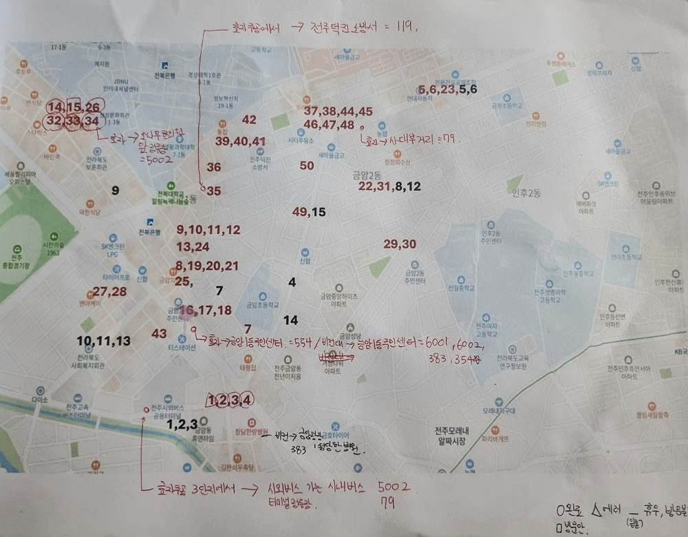

### 포스기 new 버전 앱 설치알바 
자료구조 이준 교수님이 추천해주셔서  
1시에 교육 받으러 갔다.  
사실 현장까지 보여주신다고  
수업까지 늦었지만.. 재밌었다  
전주맛배달이라는 배달앱이다  
그 안에 직원들은 파이썬, 자바 같은 걸로  
앱 만드시는 것 같다. 열코딩 하고 계셨다.  
이건 현장알바이자, 건당 알바다.  
물론 홀서빙 편의점 등 면접, 사람대응  
어느정도 해봤지만 그래도 이런 현장알바는 처음..  
  
포스기 앱 설치 건당 8000원이고  
지도랑 리스트 있어서 이름 보고 하면 된다.  
그냥 그런 거다  

*** 
### 알바 방식 
  
정해진 곳 가서  
전주맛배달에서 왔는데  
앱이 새로 바뀌어서 새롭게  
설치 해드려도 될까요 하면서 하고 들어감.  

그리고 링크 들어가서 폴더 중  
ez.클라이언트라 된 건 바탕화면으로 빼고  
(화면 안 나가지면 ctrl+z, D+윈도우, ctrl+v)  

그리고 맨 아래 설치파일 하고  
원래 앱 계정 아이디 출력상태 메모해서  
폰으로 가맹점 검색하고 아이디는 그대로  
정해진 비번(예시: 1만 n개라거나)으로 해서  
계정 만들고 자동로그인 걸고 세팅 맞추고  
테스트출력까지 되면 성공  
  
그리고 설치한 앱 아이디 잘 나오는 거 찍고  
창 닫기 해주면 된다.  

그리고 1월 1일에 예전꺼는 프로그램 닫히고  
이렇게 바뀐다 나와있는 팻말 드리고 설명하고  
사장님 모바일 앱 필요하다 하면 깔아드리고 끝  
  
***
  
문제가 다른 애들보다  
지역이 띄엄띄엄 있어서  
참여하기 어려운 정도🥺  
요즘 바빠서 얼마나 가능할진 모르겠지만..  

```
11-26  
1. BHC치킨 금암진북점 : 프린터 불가 
+ 예외사항: 기존 프로그램도 프린터가 안됐음. 
2. 남문떡볶이: 완료 
3. 신포우리만두전주터미널점: 완료 
4. 오우리도시락: 완료
```
  
```
11-27 
14. 테트리스찜닭: 완료
15. 땡땡이상추튀김: 키보드 설치 불가로 사장님이 오전에 오라며 앱 설치를 거부함.  
26. 포티커피: 완료 
32. 쌈쌘: 완료
33. 텐퍼센트커피전북대점: 완료
34. 피자닭터 전주2호점: 완료
```
다음은 혁신도시에서 포스하는 친구  
도와주러 갈 것 같다.  
특강도 있으니 이번주는 패스  

이번에 놀란 게 생각보다 사람들이  
의심하고 귀찮아서 오전에 오라 나가라 한다  
키보드가 없는 곳은 어떻게 링크 치라고..  
구글에서 마우스로 가상키보드 쳐도 안 먹히고  
연결도 안 해주신다고 하고  
대부분 가게가 나가라 나가라 하고  

물론 잘 진행되는 곳은 매우 소수였음 이때까진  
바이러스라면서 아예 안 깔려서 보안 건들기도 하고  
사장님이 뒤에서 엄청 의심하고 문의한다하고 캐묻기도 하고  
사장님 안 계신대서 전화 되는지 톡 되는지  
사장님이 오케이 하면 연락 달라면서 다른 곳 돌고  
특정 고객층 영업하는 사람 된 기분이었달까😮  
그래도 같이 식당 찾아준 친구 있으니  
이번에 혁신도시 따라가줘야겠음  
  
### 진행현황 
  
  
나 의외로 서비스직 잘 맞는 듯  
그래도 창업 하면 좋으니까..  
게임 개발 열심히 하자😉  

```
11-27 
14. 테트리스찜닭: 완료
15: 상추땡땡이: 키보드 설치 불가로 사장님이 오전에 오라며 앱 설치를 거부함.  
26. 포티커피: 완료 
32 쌈쌘: 완료
33. 텐퍼센트커피전북대점: 완료
34. 피자닭터 전주2호점: 완료
```
  
```
11-28
9. 크라운호프만성점: 완료
12. 화요스시 만성혁신점본점 : 완료
10. 가정식백반도솥점: 완료
15. 롯데리아 전주법원점: 에러
13. 바르다김선생 전주만성점: 완료 
6. 카페삼거리: 설치거부 
컴퓨터 바꿔야해서 나중에 
12월 중순 낮에 2~3시 방문 부탁  
3. 만나만나족발 굴보쌈: 완료
```

```
12-2
3. 청년피자 전주혁신점: 완료 
4. 신포우리만두 전북혁신도시점: 완료
5. 첨단공원국밥전주혁신점: 완료 
```
  
```
12-03 
4. 권씨네족발 혁신점: 완료 
8. 오원집혁신점: 본인 설치 선택, 사장님 포스기 용량이 부족해 설치가 불가능하대서 설치방법 계정 프린터세팅상태 알려드림. 1월 1일 전에 본인이 앱 설치하겠다고 하셨다.  
2. 마왕족발전주혁신도시점: 완료
1. 푸라닭 전주혁신도시점: 완료 
6. 충만치킨혁신점: 완료 
8. 대동집 전주혁신점: 완료 + 프린터가 잘 나오긴 하지만, 원래 전주맛배달만 유독 프린터 폰트가 깨지는 오류가 있다고 함. 전 프로그램도! 그러므로 관계자분 채택 필요.  
```

```
12-04
4. 카페 어쩌다 버거: 완료 
7. 짬뽕애: 거절 
8. 마당김밥만성점: 완료 
10. 점드락: 포스기가 마감 되었기에 거절
```
