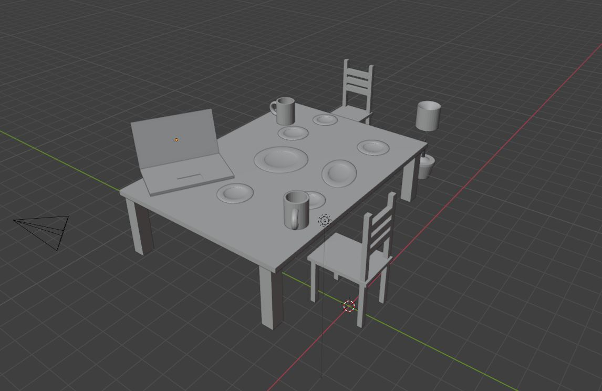

2025-09-04  
  
기간이 짧아 아쉽지만  
2학년 2학기가 맛도리 수업  
오늘은 나름 OT  
  
시험으로 제한 시간 안에 사과 만들기 할 수도 있고  
저번에는 조별로 맵 만들기 했음.  
완성 못했으면 예쁘냐 대충이다에 따라 점수 다름  
  
1차원 가로x  
2차원 가로x 세로y  
3차원 가로x 세로y 깊이z  
  
### 3D에 대하여 

#### 각 뷰의 명칭 

Top 윗면  
Front 정면  
Side 옆면  
  
탑 뷰를 보면~ 프론트 뷰를 보면~  
right 사이드 뷰를 보면~ left 사이드 뷰도  
등의 커뮤니티에서 필요  
  
#### 3D 모델링 표현 방식 

WireFrame, Surface, Solid  
  
- 와이어프레임 모델링 : 선으로 가벼운  
- 서페이스 모델링: 곡면 모델링이라고  
표면만 존재하고 물체의 내부 정보를 제공X  
애니메이션 필름형이나 화면용 데이터용  
- 솔리드 모델링: 부피 무게 가공 전 상태 예측  
  
일반적으로 서페이스나 솔리드 많이 씀.  
전환하면서 선 많은 거랑, 일반 모습이랑 둘 다 보면서 작업  
  
#### 대략 이해한 모델링 & 렌더링 

모델링: 네모네모로 물체 만들고 모양 위치 너비 등 맞추고 배치. 오브젝트만 잡기  
또한 WireFrame, Surface, Solid 종류도 모델링 종류 포함.  
렌더링: 빛 조절이랑 색이랑 재질(투명 유리, 천, 나무 타일) 넣고 일단 진짜처럼  
  
렌더링이 복잡할 수록 오래 걸림  
그래서 컴 사양이 높아야 잘 돌아감.  
사양 좋아야겠네? 모델링에선 ㄱㅊ은데 렌더링에서 버벅  
렌더링 불러오는 속도가 오래 걸리기도 하고  
그나마 인테리어 모델링은 괜찮아도  
애니메이션은 효과 많아서 빡셈. (털 물 머리카락)  
  
텍스처링 : 재질처리  
뭐 등등 있음.  
  
1. 폴리곤 방식 : 기본 점 선 면을 직접 편집  
2. NURBS 모델링 : 수학적 뭐로 해서 부드럽게 곡선 만드는 등  
  
우리는 폴리곤으로 직접 할 거  
  
매시: 모양 만들고  
커브: 곡선 만들고  
이런 거 같음.  
  
모델링하고 텍스처 입혀서  
그 재질처럼 보이게 하는 게 많다.  
  
#### 스컬프팅 방식 (캐릭터)

찰흙으로 넣고 빼고 하며 인물 묘사할 때 많이 씀.  
이러한 형태는 안 함. 이걸 할 환경이 없고 미적 감각 필요. 어려움.  
캐릭터, 식물 등의 형태용  
  
#### 리깅 

관절 추가하는 것처럼  
모델링에 심어줌. 어느 부분에서 값 넣고  
저희도 리깅은 거의 안 할 거 같음 수업에선.  
게임이나 영상과가 아니라..  
  
주로 할 모델링이 공간.  

*** 
  
2025-09-11  
  
### 기본 키 

네모 많아서 그룹 지을 때 Ctrl + J  
  
선택한 것 크기 조정 Z S  
  
선 만들어서 늘리고 줄이고 E  
  
  
  

